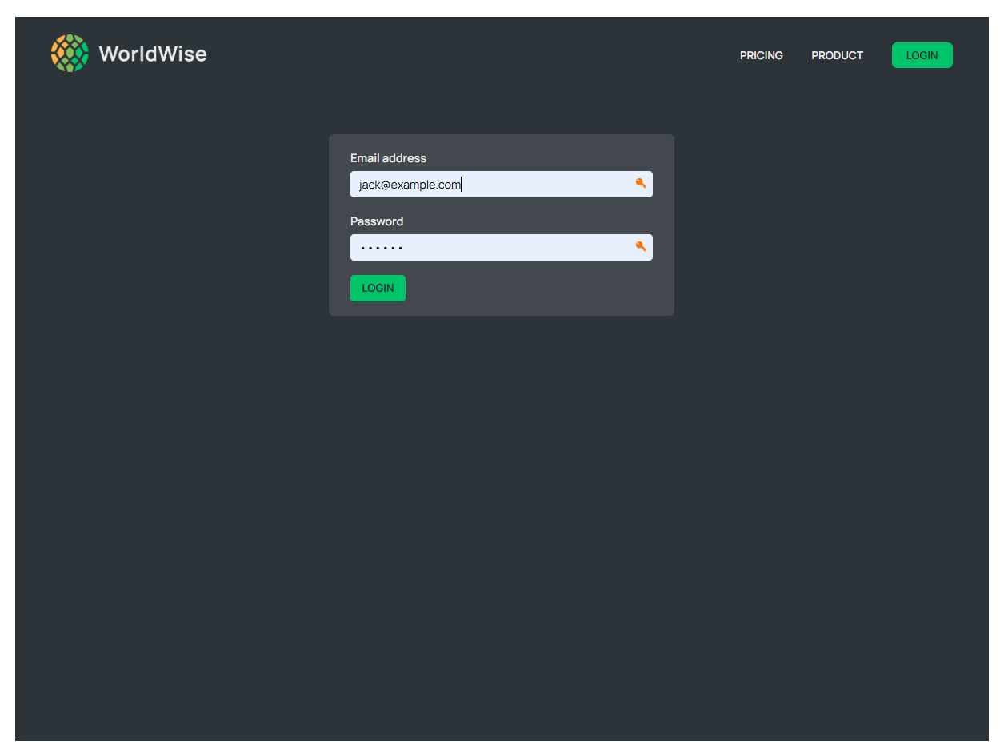

# 🌍 WorldWise App  

The **WorldWise App** is a dynamic travel tracker that allows users to log their travel experiences, visualize visited locations on a map, and organize trip details. It combines the power of modern web technologies with an interactive, map-driven interface to enhance user engagement.  


---  

## 🚀 Features  

### **1. Interactive Map**  
- View visited locations with markers on a detailed world map.  
- Click anywhere on the map to add new travel details for that location.  

### **2. Trip Management**  
- Add and edit trips with details such as date, notes, and city name.  
- Automatically fetch city and country data using geolocation.  

### **3. User Authentication**  
- Secure login/logout functionality with simulated user authentication.  

### **4. Country and City Management**  
- Organize trips by country and city for easy navigation.  
- View details and notes for individual trips.  

### **5. Responsive Design**  
- Fully responsive interface that works seamlessly across devices.  

### **6. Realtime Updates**  
- Realtime updates of city and trip data using local and API-driven interactions.  

---  

## 🛠️ Technologies Used  

- **React**: Component-based user interface development.  
- **React Router**: Navigation and routing across multiple pages.  
- **Leaflet.js**: Interactive map integration for location-based features.  
- **CSS Modules**: Scoped styling for reusable and maintainable components.  
- **Context API**: Global state management for cities and authentication.  
- **JSON Server**: Mock backend API for storing and retrieving trip data.  

---  

## 📖 What I Learned  

This project helped me gain expertise in the following areas:  

1. **React and React Router**  
   - Built a multi-page React application using `BrowserRouter` and dynamic routes.  
   - Implemented nested and protected routes for secure navigation.  

2. **State Management with Context API**  
   - Managed global state using `useReducer` and Context API for cities and authentication.  

3. **Leaflet.js Integration**  
   - Embedded an interactive map with real-time geolocation and marker handling.  

4. **CSS Modules**  
   - Scoped styles to components for maintainability and reusability.  

5. **Dynamic Geolocation**  
   - Integrated geolocation API to auto-fetch city and country details based on user clicks.  

6. **API Handling**  
   - Used `JSON Server` to simulate a backend for managing cities and trip data.  

7. **Authentication Simulation**  
   - Implemented basic user authentication and role-based navigation controls.  

---  

## 🌟 Future Improvements  

- **Trip Insights**: Add statistics like total countries visited and days traveled.  
- **User Profiles**: Enable multiple user profiles with personalized trip data.  
- **Advanced Map Features**: Add clustering for multiple locations and heatmaps for frequently visited areas.  
- **Search Functionality**: Search for cities or countries to quickly find travel details.  

---  

## 🧑‍💻 Getting Started  

### Prerequisites  
- Node.js installed on your local machine.  

### Installation  

1. Clone the repository:  
   ```bash
   git clone https://github.com/your-username/worldwise-app.git  
   cd worldwise-app  
   ```  

2. Install dependencies:  
   ```bash
   npm install  
   ```  

3. Start the application:  
   ```bash
   npm start  
   ```  

4. Run the local API server:  
   ```bash
   npx json-server --watch data/db.json --port 8000  
   ```  

5. Open your browser and navigate to `http://localhost:3000`.  

---  

## 📷 Screenshots  





---  

## 🤝 Contributions  

The projects have been completed during the Jonas Schmedtmann course.

---  

## 📝 License  

This project is licensed under the MIT License.  

---  

Enjoy your journey with WorldWise! 🌍✈️  
